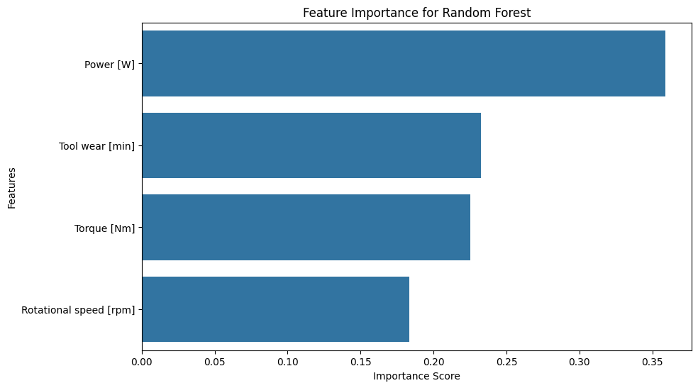

# Predictive Maintenance for Industrial Machinery

**Project Status:** Complete

## Project Overview

This project aims to predict unexpected machine failures using synthetic sensor data from industrial machinery. By developing a machine learning model, the goal is to enable a proactive, predictive maintenance strategy, reducing costly production downtime and optimizing maintenance schedules. This analysis uses the "Predictive Maintenance Dataset (AI4I 2020)".

### Dataset:

S. Matzka, "Explainable Artificial Intelligence for Predictive Maintenance Applications," 2020 Third International Conference on Artificial Intelligence for Industries (AI4I), 2020, pp. 69-74, doi: 10.1109/AI4I49448.2020.00023.

## Technologies Used

- Python
- Pandas
- NumPy
- Scikit-learn
- XGBoost
- Seaborn & Matplotlib
- Jupyter Notebook

## Key Features

- **Comprehensive EDA:** In depth exploratory data analysis to uncover patterns and core predictive features.
- **Feature Engineering:** Created a 'Power' feature that proved to be the most influential predictor.
- **Model Comparison:** Trained and evaluated four different classification models (Logistic Regression, KNN, Random Forest, XGBoost).
- **Hyperparameter Tuning:** Optimized all models using GridSearchCV to maximize performance, with a focus on improving recall score.

## Key Results

The final tuned Random Forest model was identified as the best-performing model for this business problem. It successfully identifies 74% of all machine failures while maintaining a high degree of reliability. The most important features were found to be the engineered 'Power' feature, followed by 'Torque' and 'Rotational Speed'.



| Model | Precision (Failure) | Recall (Failure) | F1-Score (Failure) |
| :--- | :---: | :---: | :---: |
| **Tuned Random Forest** | 0.68 | **0.74** | **0.71** |
| Tuned XGBoost | **0.74** | 0.69 | **0.71** |


## How to Run

1.  **Clone the repository:**
    ```bash
    git clone https://github.com/wsj20/predictive-maintenance-sklearn.git
    ```
2.  **Create and activate a virtual environment:**
    ```bash
    python -m venv venv
    source venv/bin/activate  # On Windows, use `venv\Scripts\activate`
    ```
3.  **Install the dependencies:**
    ```bash
    pip install -r requirements.txt
    ```
4.  **Run the Jupyter Notebook:**
    ```bash
    cd notebooks
    jupyter notebook "Predictive Maintenance.ipynb"
    ```

## Conclusion

The developed Random Forest model provides a robust solution for predicting machine failures. By integrating this model a business could transition from a reactive to a proactive maintenance strategy, preventing costly downtime and improving operational efficiency.

## Contact

Created by Will Clarke
- [LinkedIn](https://www.linkedin.com/in/will-clarke-cs/)
- [GitHub](https://github.com/wsj20)
